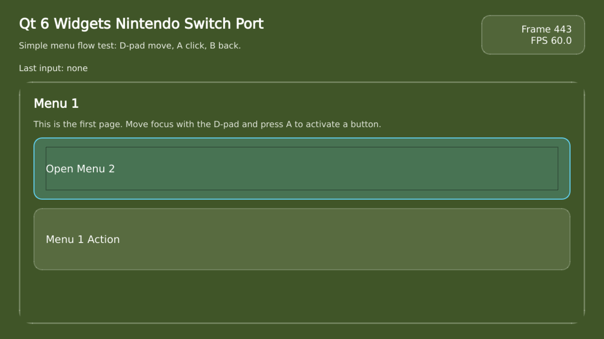

# Qt 6 Nintendo Switch Demo

This repository packages a reproducible Qt 6 Nintendo Switch bring-up demo based on a forked `qtbase` tree, a small Qt Widgets homebrew application, and the scripts and documentation needed to build, test, and run it.



## Status

Current verified state:

- A forked Qt 6 `qtbase` can be cross-built for Nintendo Switch.
- The custom `switch` QPA plugin renders a Qt Widgets application.
- The demo application runs in Astris.
- Input works in the Astris demo.

This is still a bring-up demo, not a full upstream-ready Qt for Switch port.

## Repository Layout

- `demo/widgets-app/`
  Qt Widgets demo homebrew app.
- `demo/quick-app/`
  Qt Quick smoke-test homebrew app.
- `scripts/`
  Helper scripts for building host tools, configuring the Switch target, running in Astris, and uploading to real hardware over FTP.
- `extras/`
  Supporting files such as the Switch CMake toolchain file.
- `docs/`
  Detailed setup, build, test, emulator, and change documentation.
- `third_party/qtbase/`, `third_party/qtdeclarative/`, `third_party/qtshadertools/`
  Git submodules containing the Qt Switch port and the Qt Quick dependency chain.

## Quick Start

Run the documented wrapper scripts from the repository root.

1. Read `docs/downloads.md`.
2. Prepare the environment from `docs/development-environment.md`.
3. Pull the submodule as described in `docs/build-and-run.md`.
4. Build host tools and configure Qt as described in `docs/build-and-run.md`.
5. Verify the result in Astris using `docs/astris-testing.md`.

The demo build output ends up at:

- `demo/widgets-app/qt6-switch-widgets-probe.nro`
- `demo/widgets-app/qt6-switch-widgets-probe.elf`

## Qt Base Source

The repository uses a git submodule:

- `third_party/qtbase`

That submodule points to:

- fork: [karaketir16/qtbase](https://github.com/karaketir16/qtbase)
- branch: `qt6-switch-demo-v6.8.3`

## Astris

Astris release page:

- [Astris.Binaries releases](https://github.com/V380-Ori/Astris.Binaries/releases)

Switch-specific guest trace logging is disabled by default. Set `QT_SWITCH_DEBUG_LOG=1` before running an Astris wrapper script to enable probe logs such as `qt6-switch-probe.log`, `qt6-switch-widgets-probe.log`, or `qt6-switch-quick-probe.log`.

See `docs/what-changed.md` for the higher-level summary.

## Qt Quick scope

The merge target for this branch is the Qt Quick support path:

```text
QtBase -> QtShaderTools/qsb -> QtDeclarative/QML/QtQuick -> Qt Quick demo
```
